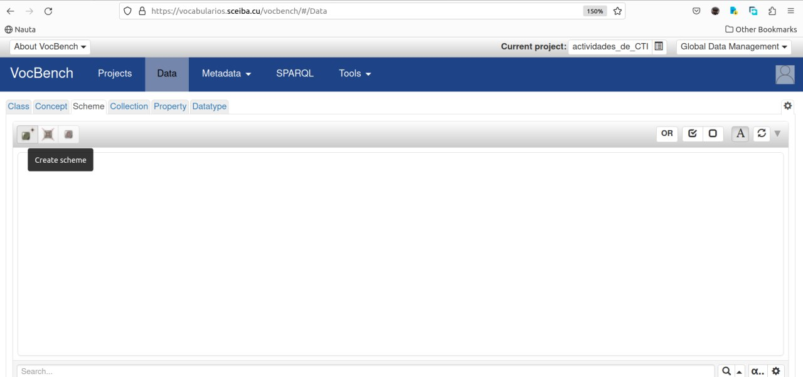

# Edición de vocabularios controlados utilizando la herramienta Vocbench

1- Acceder a [Vocbench](https://vocabularios.sceiba.cu/vocbench/), utilizando las credenciales.

2- Ir a la sección **Projects**

Dentro de la carpeta CITMA, han sido creados los vocabularios necesarios para el Repositorio de Programas, Proyectos y Premios. Algunos de estos vocabularios son heredados de otras plataformas, por lo que ya contienen los términos; otros son específicos y se necesita agregar los términos que contienen.

3- Seleccionar y abrir el  proyecto (vocabulario), que se desea trabajar.

Nótese que al abrir un vocabulario se activan los menus Data, Metadata, SPARQL y Tools.

4- Una vez abierto un vocabulario en llendo al menu **Data** se pueden editar los datos de este vocabulario.

5- El primer paso para agregarle datos a un vocabulario SKOS es crear un esquema. Para ello debe ir a la pestaña **Scheme**.

Se propone utilizar la palabra **scheme** para nombrar el esquema de los vocabularios nuevos. Esta es la forma que siguen los vocabularios de COAR.

6- Una vez creado el esquema se puede proceder a adicionar todos los términos (con las correspondientes relaciones entre ellos), en la pestaña **Concept**.

